# 业务流程定义文档

## 1. 核心业务流程

### 1.1 用户注册和认证流程

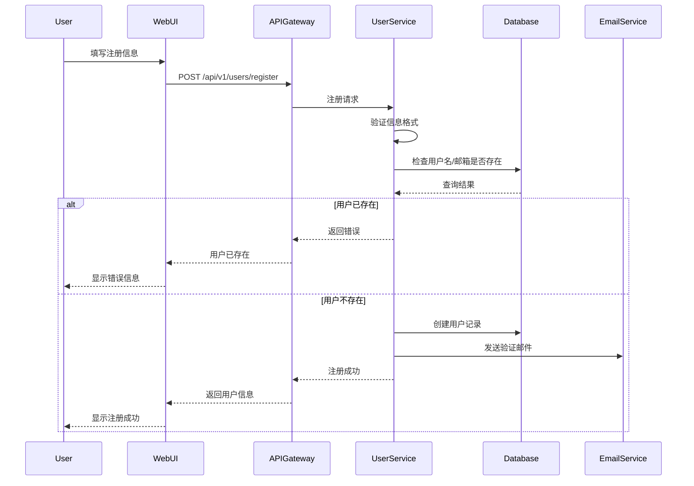

**流程说明**:
1. 用户填写注册信息（用户名、邮箱、密码）
2. 前端验证基本格式
3. 后端验证用户名和邮箱唯一性
4. 密码加密存储（BCrypt）
5. 发送邮箱验证链接
6. 用户点击链接完成邮箱验证

**关键节点**:
- 用户名和邮箱唯一性检查
- 密码强度验证（至少 8 位，包含大小写字母和数字）
- 邮箱验证链接有效期 24 小时

### 1.2 订单提交流程

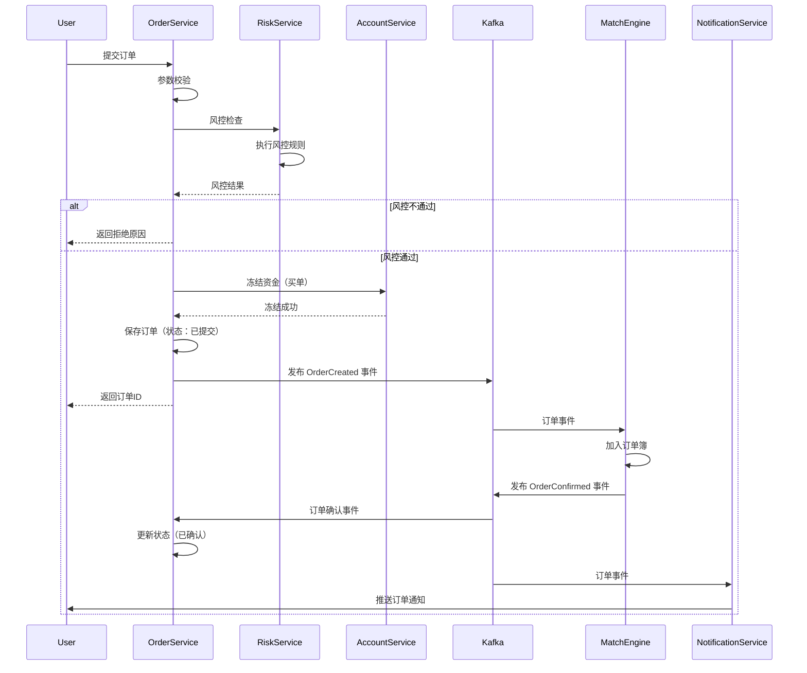

**流程说明**:
1. 用户提交订单（品种、方向、价格、数量）
2. 参数校验（价格、数量合法性）
3. 风控检查（限额、持仓、自成交）
4. 买单冻结资金
5. 保存订单到数据库
6. 发送订单到撮合引擎
7. 撮合引擎确认订单
8. 推送订单状态通知

**关键节点**:
- 风控检查必须通过
- 买单必须先冻结资金
- 订单状态：已提交 → 已确认 → 部分成交/全部成交
- 异步处理，快速返回订单ID

### 1.3 订单撮合流程

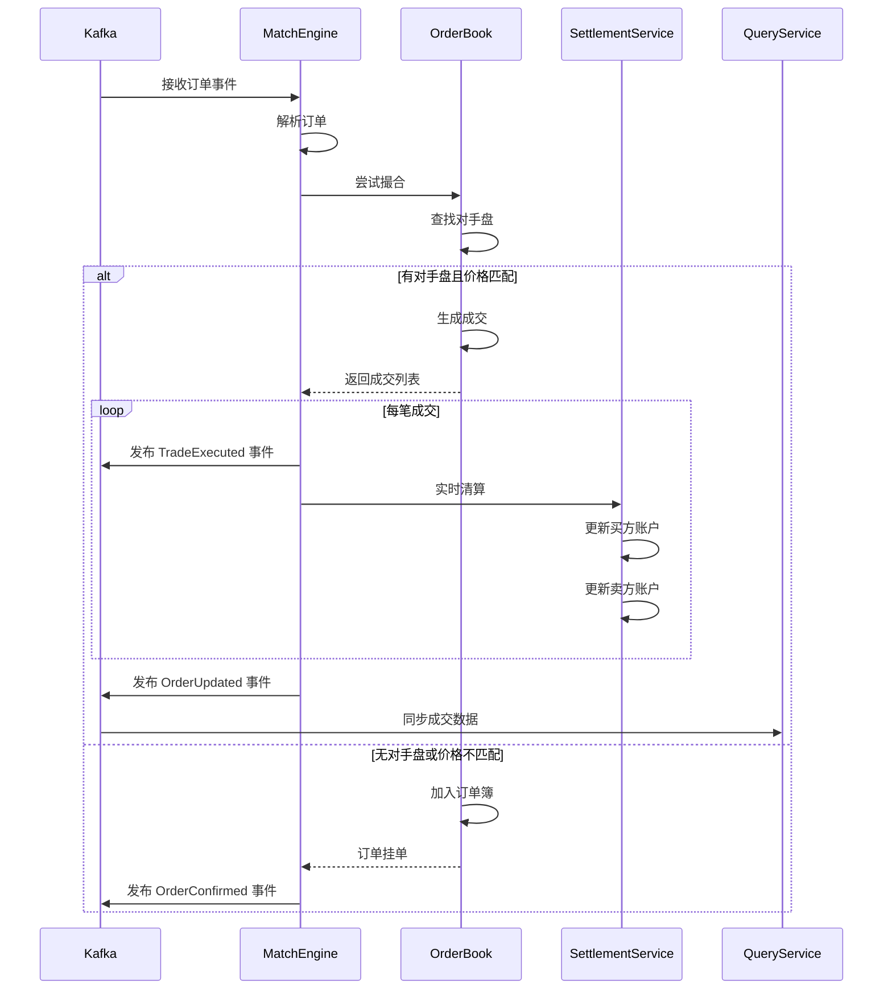

**流程说明**:
1. 撮合引擎接收订单
2. 查找订单簿中的对手盘
3. 按价格-时间优先原则撮合
4. 生成成交记录
5. 实时清算买卖双方账户
6. 发布成交事件
7. 未成交部分加入订单簿

**关键节点**:
- 价格优先：买单价格 ≥ 卖单价格才能成交
- 时间优先：同价格订单按时间先后撮合
- 成交价格：使用挂单（maker）价格
- 实时清算：成交即清算

### 1.4 订单撤销流程

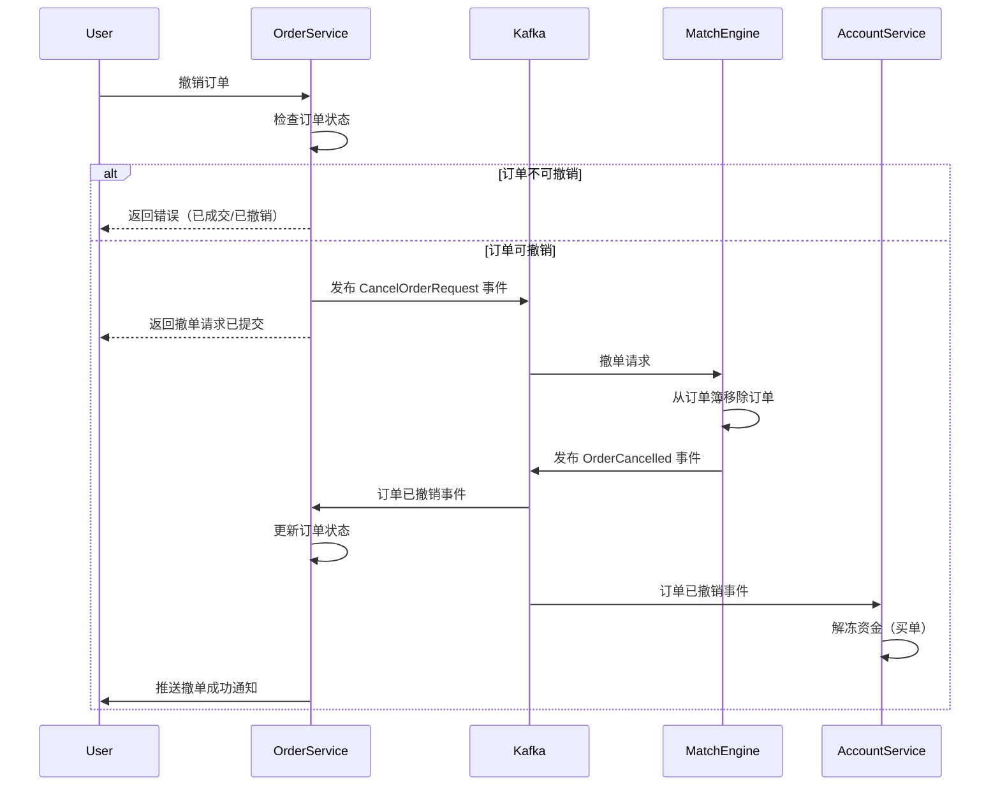

**流程说明**:
1. 用户请求撤销订单
2. 检查订单状态（只能撤销未成交或部分成交的订单）
3. 发送撤单请求到撮合引擎
4. 撮合引擎从订单簿移除订单
5. 解冻买单的冻结资金
6. 更新订单状态为已撤销
7. 推送撤单通知

**关键节点**:
- 只能撤销未完全成交的订单
- 撤单是异步操作
- 买单撤销后立即解冻资金
- 部分成交的订单撤销后，已成交部分不受影响

### 1.5 资金存取款流程

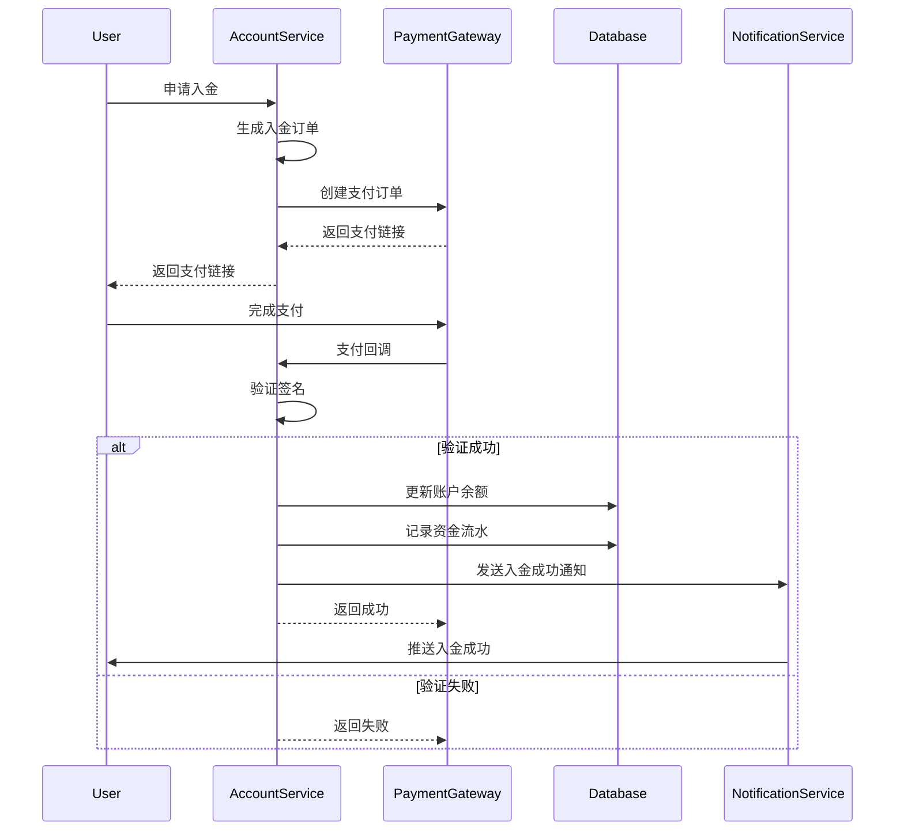

**流程说明**:

**入金流程**:
1. 用户申请入金
2. 生成入金订单
3. 调用支付网关
4. 用户完成支付
5. 接收支付回调
6. 验证回调签名
7. 更新账户余额
8. 记录资金流水
9. 推送入金成功通知

**出金流程**:
1. 用户申请出金
2. 检查可用余额
3. 冻结出金金额
4. 人工审核（可选）
5. 调用支付网关转账
6. 扣除账户余额
7. 记录资金流水
8. 推送出金成功通知

**关键节点**:
- 入金：支付回调验证签名
- 出金：检查可用余额（余额 - 冻结 - 保证金）
- 出金可能需要人工审核
- 所有资金变动记录流水

### 1.6 日终清算流程

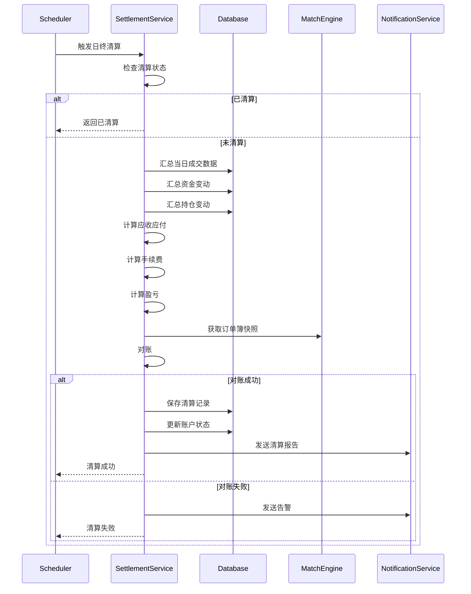

**流程说明**:
1. 定时任务触发日终清算（通常在交易日结束后）
2. 检查当日是否已清算
3. 汇总当日所有成交数据
4. 汇总资金变动（入金、出金、手续费）
5. 汇总持仓变动
6. 计算每个账户的应收应付
7. 计算手续费
8. 计算已实现盈亏和未实现盈亏
9. 与撮合引擎对账
10. 保存清算记录
11. 生成清算报告

**关键节点**:
- 清算时间：交易日结束后（如 23:00）
- 对账：确保业务系统和撮合引擎数据一致
- 清算失败：发送告警，人工介入
- 清算报告：发送给用户和管理员

## 2. 异常处理流程

### 2.1 订单提交失败处理

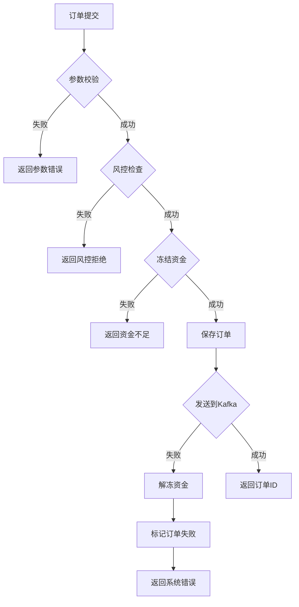

**处理策略**:
- 参数错误：立即返回，不记录订单
- 风控拒绝：记录风控事件，返回拒绝原因
- 资金不足：返回错误，不冻结资金
- Kafka 发送失败：解冻资金，标记订单失败，记录日志

### 2.2 撮合引擎故障处理

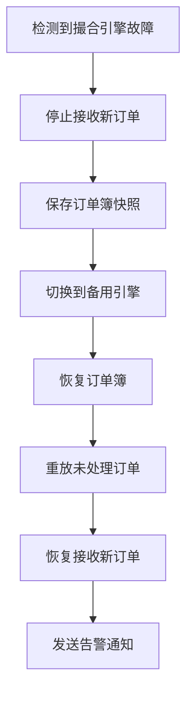

**处理策略**:
- 主备切换：自动切换到备用撮合引擎
- 订单簿恢复：从快照恢复订单簿状态
- 订单重放：重放故障期间的订单
- 数据一致性：确保主备数据一致

### 2.3 数据库故障处理

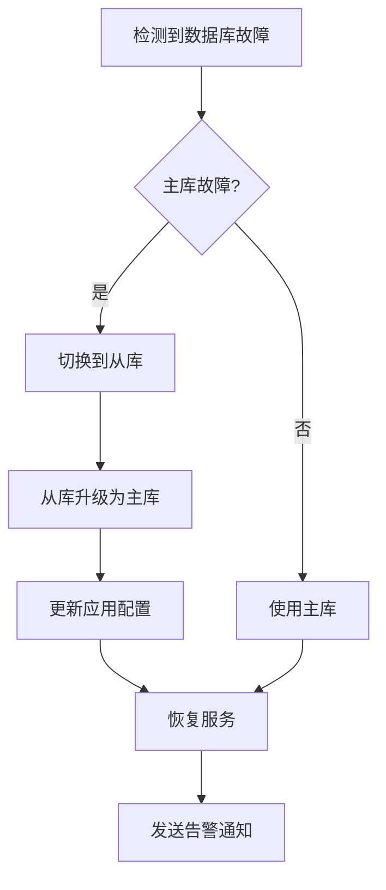

**处理策略**:
- 主从切换：自动切换到从库
- 读写分离：读操作使用从库，写操作使用主库
- 连接池：使用连接池自动重连
- 降级策略：数据库不可用时，使用缓存提供只读服务

### 2.4 消息队列故障处理

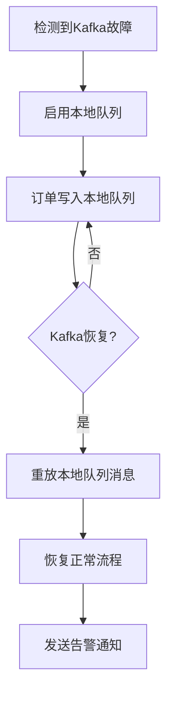

**处理策略**:
- 本地队列：Kafka 不可用时，使用本地队列缓存
- 消息重放：Kafka 恢复后，重放本地队列消息
- 消息去重：使用消息ID去重，避免重复处理
- 降级策略：Kafka 长时间不可用，拒绝新订单

## 3. 数据同步流程

### 3.1 订单数据同步

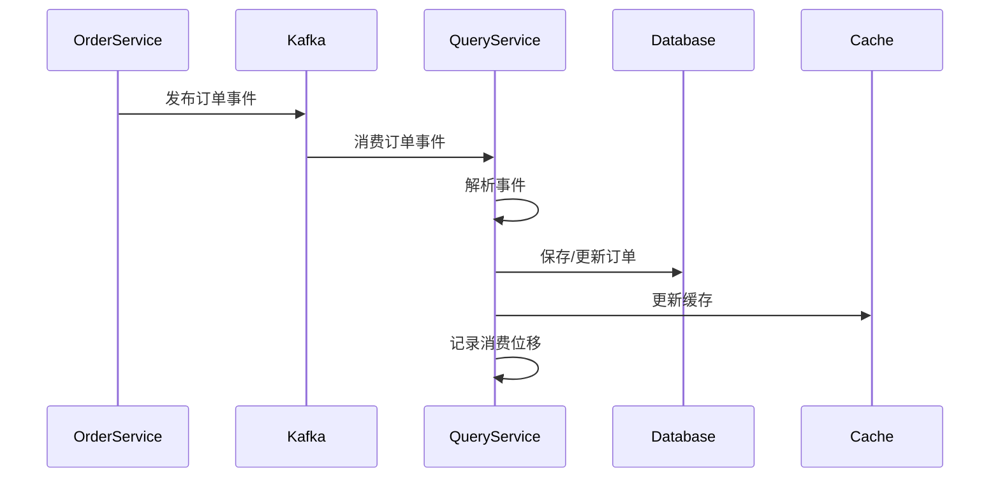

**同步策略**:
- 事件驱动：通过 Kafka 事件同步
- 幂等性：使用事件ID去重
- 顺序保证：同一订单的事件按顺序处理
- 延迟监控：监控消费延迟，超过阈值告警

### 3.2 行情数据同步

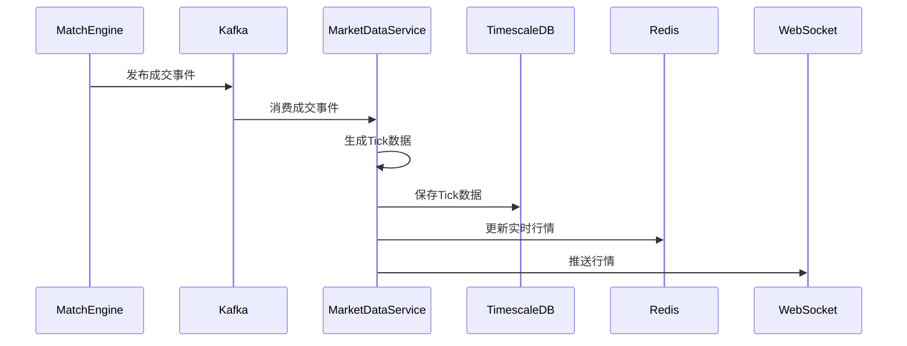

**同步策略**:
- 高频数据：使用 Kafka 高吞吐传输
- 时序存储：使用 TimescaleDB 存储历史行情
- 实时缓存：使用 Redis 缓存最新行情
- 推送优化：批量推送，减少网络开销

## 4. 监控和告警流程

### 4.1 系统监控

**监控指标**:
- 订单提交率（TPS）
- 撮合延迟（P99）
- API 响应时间（P95）
- 数据库连接池使用率
- Kafka 消费延迟
- 缓存命中率
- 错误率

**告警规则**:
- 订单提交率异常（突增或突降）
- 撮合延迟超过 100 微秒
- API 响应时间超过 100 毫秒
- 数据库连接池使用率超过 90%
- Kafka 消费延迟超过 10 秒
- 错误率超过 1%

### 4.2 业务监控

**监控指标**:
- 活跃用户数
- 订单数量
- 成交量
- 成交金额
- 持仓总量
- 资金总量

**告警规则**:
- 异常交易检测（大额订单、频繁交易）
- 风控事件（超限、自成交）
- 清算失败
- 对账不一致

## 5. 运维流程

### 5.1 发布流程

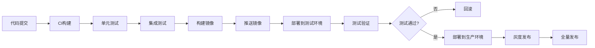

**发布策略**:
- 灰度发布：先发布 10% 流量，观察无异常后全量发布
- 蓝绿部署：保留旧版本，新版本验证通过后切换
- 回滚机制：发现问题立即回滚到上一版本
- 发布窗口：选择低峰期发布（如凌晨）

### 5.2 故障处理流程

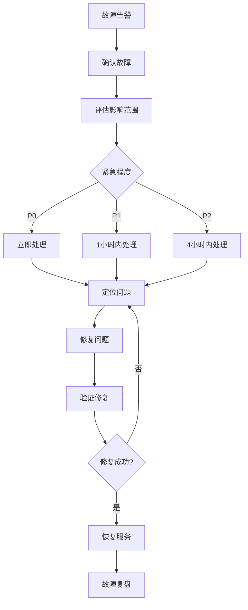

**故障等级**:
- P0：核心功能不可用（如订单提交失败）
- P1：重要功能受影响（如查询缓慢）
- P2：次要功能异常（如报表生成失败）

**处理原则**:
- 快速响应：收到告警立即响应
- 先恢复后分析：优先恢复服务，再分析根因
- 记录日志：详细记录故障处理过程
- 故障复盘：总结经验，避免再次发生

## 6. 总结

本文档定义了交易系统的核心业务流程，包括：

1. **核心流程**: 用户注册、订单提交、订单撮合、订单撤销、资金存取、日终清算
2. **异常处理**: 订单失败、引擎故障、数据库故障、消息队列故障
3. **数据同步**: 订单同步、行情同步
4. **监控告警**: 系统监控、业务监控
5. **运维流程**: 发布流程、故障处理

这些流程确保系统的稳定性、可靠性和可维护性。
